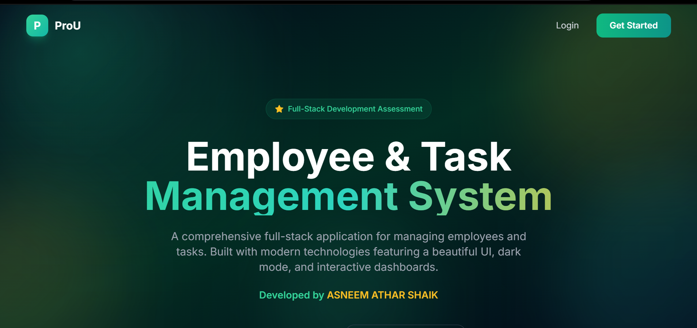
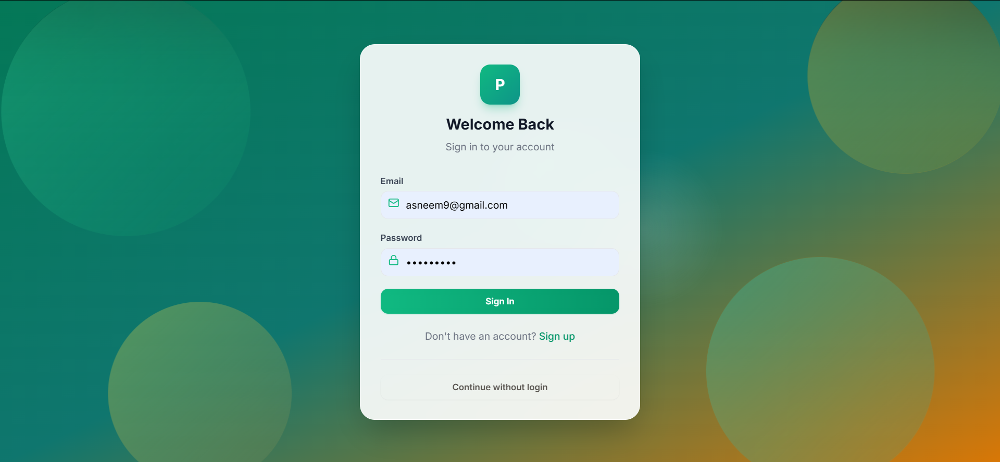
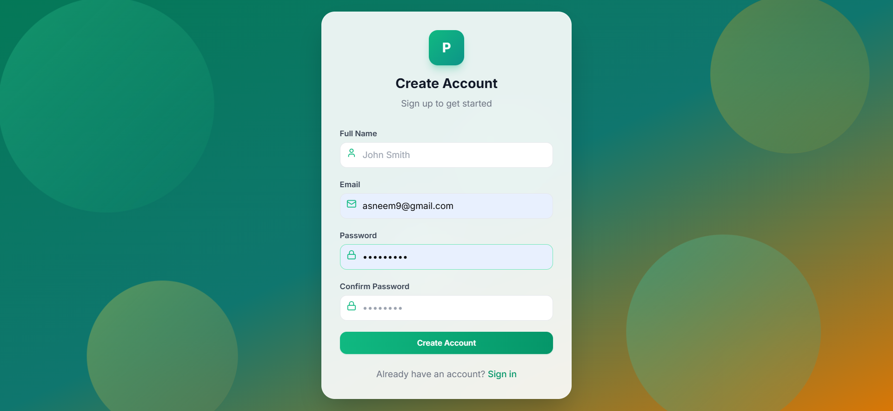
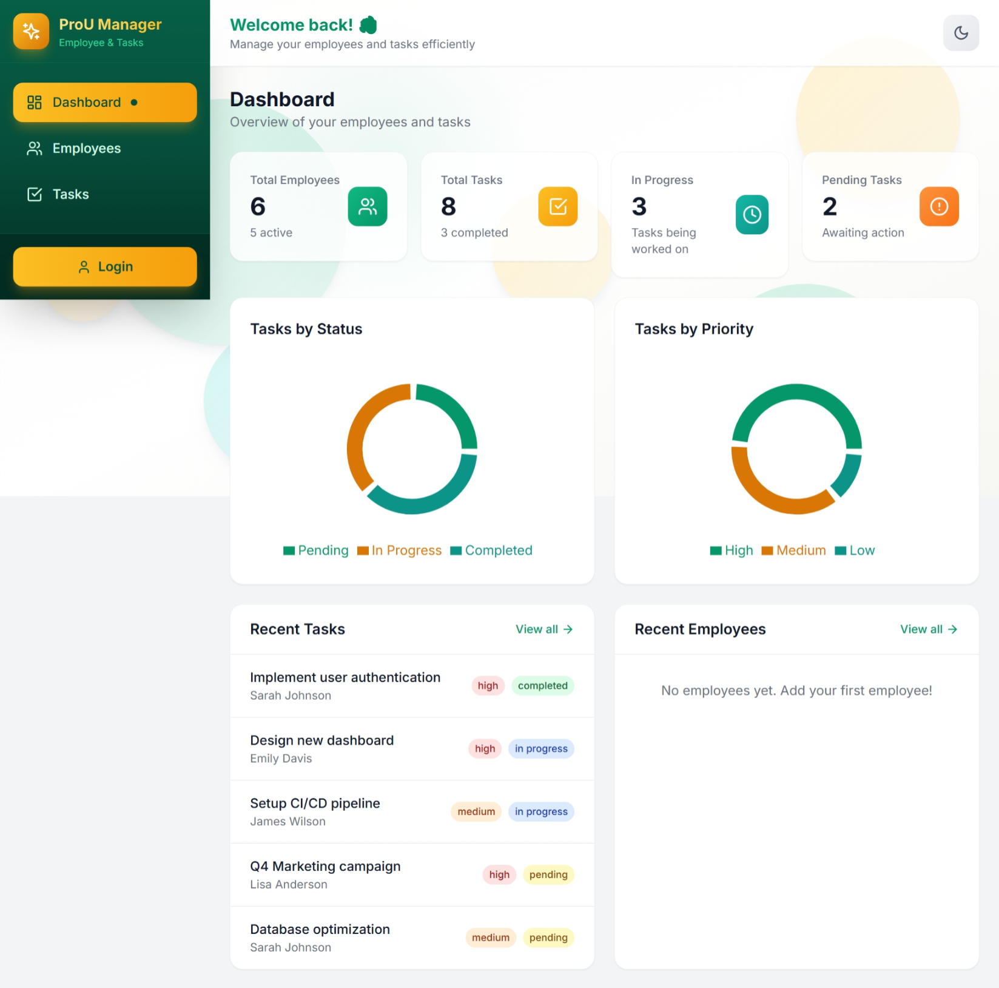
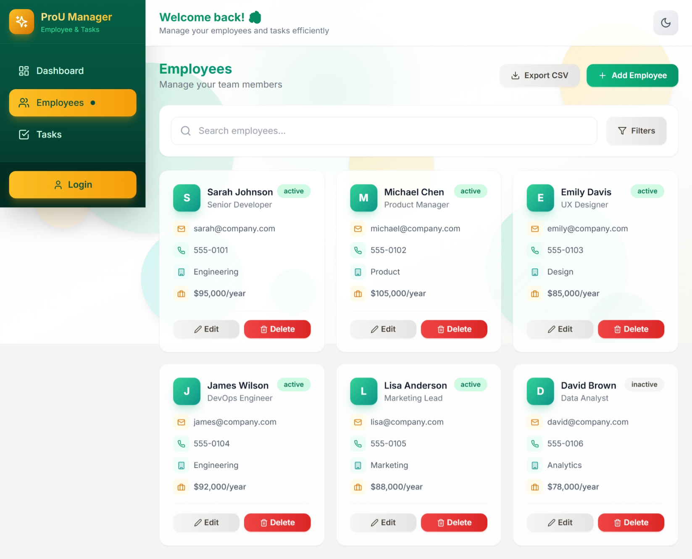
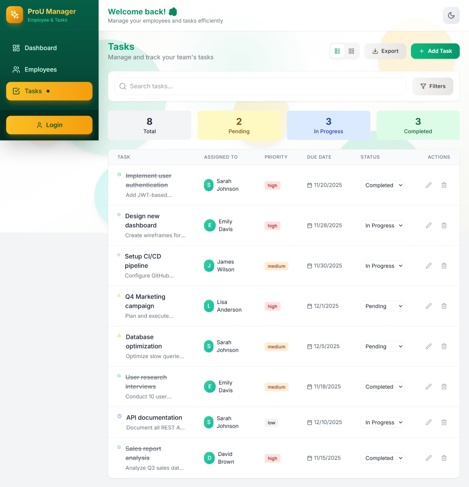
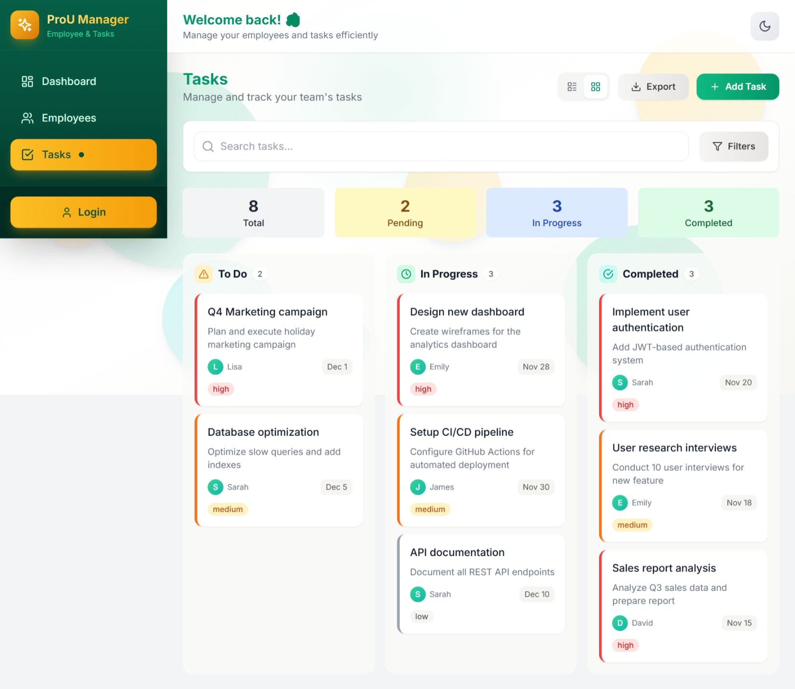

# 🏢 Employee & Task Management System

A modern, full-stack web application for managing employees and tasks with a beautiful emerald & gold themed UI, interactive floating background, and comprehensive features.

**Developed by: ASNEEM ATHAR SHAIK** | Full-Stack Developer



## 🚀 Live Demo

🌐 **[https://pro-u-delta.vercel.app/](https://pro-u-delta.vercel.app/)**

> **Demo Mode**: The live app runs with mock data, allowing you to explore all features without backend setup. Login with any credentials to access the dashboard.

## 📋 Features

### Core Features
- ✅ **Landing Page** - Beautiful hero section with animated background and developer info
- ✅ **Employee Management** - Full CRUD operations for employees
- ✅ **Task Management** - Create, assign, update, and track tasks
- ✅ **Dashboard** - Visual overview with charts and statistics
- ✅ **Search & Filter** - Advanced filtering for employees and tasks
- ✅ **Responsive Design** - Works seamlessly on desktop and mobile

### Bonus Features
- ✅ **User Authentication** - JWT-based login/register system
- ✅ **Data Visualization** - Interactive charts using Recharts
- ✅ **Demo Mode** - Works without backend using mock data
- ✅ **Task Status Updates** - Quick status change from task list
- ✅ **Overdue Task Indicators** - Visual alerts for overdue tasks

### ✨ Standout Features
- ✅ **Dark Mode** - Toggle between light and dark themes with localStorage persistence
- ✅ **Kanban Board View** - Drag & drop task management with visual columns
- ✅ **Export to CSV** - Download employees and tasks data as CSV files
- ✅ **Animated Counters** - Smooth number animations on dashboard stats
- ✅ **Toast Notifications** - Real-time success/error feedback with auto-dismiss
- ✅ **Floating Background** - Interactive animated orbs that glow on hover
- ✅ **Emerald & Gold Theme** - Beautiful custom color scheme throughout the app

## 🛠️ Tech Stack

### Frontend
- **React 18** - UI Library
- **Vite** - Build tool & dev server
- **Tailwind CSS** - Utility-first CSS framework
- **React Router v6** - Client-side routing
- **Axios** - HTTP client
- **Recharts** - Charting library
- **Lucide React** - Icon library

### Backend
- **Node.js** - JavaScript runtime
- **Express.js** - Web framework
- **SQLite** (better-sqlite3) - Embedded database
- **JWT** - Authentication tokens
- **bcryptjs** - Password hashing

## 📁 Project Structure

```
pro-u/
├── backend/
│   ├── server.js          # Express server & API routes
│   ├── package.json       # Backend dependencies
│   └── .gitignore
│
├── frontend/
│   ├── src/
│   │   ├── api/           # API service functions
│   │   ├── components/    # Reusable UI components
│   │   │   ├── AnimatedCounter.jsx  # Smooth number animations
│   │   │   ├── Button.jsx          # Customizable button
│   │   │   ├── Input.jsx           # Form inputs & selects
│   │   │   ├── Layout.jsx          # App layout with sidebar
│   │   │   ├── Modal.jsx           # Reusable modal dialog
│   │   │   └── TaskKanban.jsx      # Drag & drop kanban board
│   │   ├── context/       # React context providers
│   │   │   ├── AuthContext.jsx     # Authentication state
│   │   │   ├── ThemeContext.jsx    # Dark mode toggle
│   │   │   └── ToastContext.jsx    # Toast notifications
│   │   ├── pages/         # Page components
│   │   ├── utils/         # Utility functions
│   │   │   └── export.js           # CSV/PDF export utilities
│   │   ├── App.jsx        # Main app component
│   │   ├── main.jsx       # Entry point
│   │   └── index.css      # Global styles & dark mode
│   ├── index.html
│   ├── package.json
│   ├── vite.config.js
│   ├── tailwind.config.js # Dark mode configuration
│   └── .gitignore
│
├── screenshots/           # Application screenshots
└── README.md
```

## 🚀 Getting Started

### Prerequisites
- Node.js 18+ installed
- npm or yarn package manager

### Backend Setup

1. Navigate to the backend directory:
   ```bash
   cd backend
   ```

2. Install dependencies:
   ```bash
   npm install
   ```

3. Start the server:
   ```bash
   npm start
   ```
   
   The API will be running at `http://localhost:5000`

### Frontend Setup

1. Navigate to the frontend directory:
   ```bash
   cd frontend
   ```

2. Install dependencies:
   ```bash
   npm install
   ```

3. Start the development server:
   ```bash
   npm run dev
   ```
   
   The app will be running at `http://localhost:3000`

### Quick Start (Both)

Run these commands in separate terminals:

```bash
# Terminal 1 - Backend
cd backend && npm install && npm start

# Terminal 2 - Frontend
cd frontend && npm install && npm run dev
```

## 📡 API Endpoints

### Authentication
| Method | Endpoint | Description |
|--------|----------|-------------|
| POST | `/api/auth/register` | Register new user |
| POST | `/api/auth/login` | Login user |
| GET | `/api/auth/me` | Get current user |

### Employees
| Method | Endpoint | Description |
|--------|----------|-------------|
| GET | `/api/employees` | Get all employees |
| GET | `/api/employees/:id` | Get employee by ID |
| POST | `/api/employees` | Create new employee |
| PUT | `/api/employees/:id` | Update employee |
| DELETE | `/api/employees/:id` | Delete employee |

### Tasks
| Method | Endpoint | Description |
|--------|----------|-------------|
| GET | `/api/tasks` | Get all tasks |
| GET | `/api/tasks/:id` | Get task by ID |
| POST | `/api/tasks` | Create new task |
| PUT | `/api/tasks/:id` | Update task |
| DELETE | `/api/tasks/:id` | Delete task |

### Dashboard
| Method | Endpoint | Description |
|--------|----------|-------------|
| GET | `/api/dashboard/stats` | Get dashboard statistics |

### Utility
| Method | Endpoint | Description |
|--------|----------|-------------|
| POST | `/api/seed` | Seed sample data |
| GET | `/api/health` | Health check |

## 📊 Data Models

### Employee
```javascript
{
  id: number,
  name: string,
  email: string,
  phone: string?,
  department: string,
  position: string,
  salary: number?,
  hire_date: date?,
  status: 'active' | 'inactive',
  created_at: datetime,
  updated_at: datetime
}
```

### Task
```javascript
{
  id: number,
  title: string,
  description: string?,
  status: 'pending' | 'in-progress' | 'completed',
  priority: 'low' | 'medium' | 'high',
  due_date: date?,
  employee_id: number?,
  created_at: datetime,
  updated_at: datetime
}
```

## 📸 Screenshots

### Landing Page


### Login & Register
| Login | Register |
|-------|----------|
|  |  |

### Dashboard


### Employee Management


### Task Management


### Kanban Board


## 🎯 Assumptions Made

1. **Single User Context**: The application is designed for a single organization context
2. **Employee-Task Relationship**: One task can be assigned to one employee, but an employee can have multiple tasks
3. **No File Uploads**: Employee avatars are placeholder-based
4. **Local Database**: Using SQLite for simplicity; can be migrated to PostgreSQL for production

## 🔮 Future Improvements

- [ ] Email notifications for task assignments
- [ ] Task comments and activity log
- [ ] Employee performance analytics
- [ ] ~~Drag-and-drop task board (Kanban view)~~ ✅ Implemented!
- [ ] ~~Export data to CSV/Excel~~ ✅ Implemented!
- [ ] ~~Dark mode support~~ ✅ Implemented!
- [ ] Multi-language support

## 🧪 Testing

```bash
# Run API health check
curl http://localhost:5000/api/health

# Seed sample data
curl -X POST http://localhost:5000/api/seed
```

## 📝 License

This project was created for the ProU Technology assessment.

---

**👨‍💻 Developer**: ASNEEM ATHAR SHAIK  
**📅 Date**: November 2025  
**🎯 Assessment**: ProU Technology - Full Stack Development Track  
**🔗 Live Demo**: [https://pro-u-delta.vercel.app/](https://pro-u-delta.vercel.app/)
